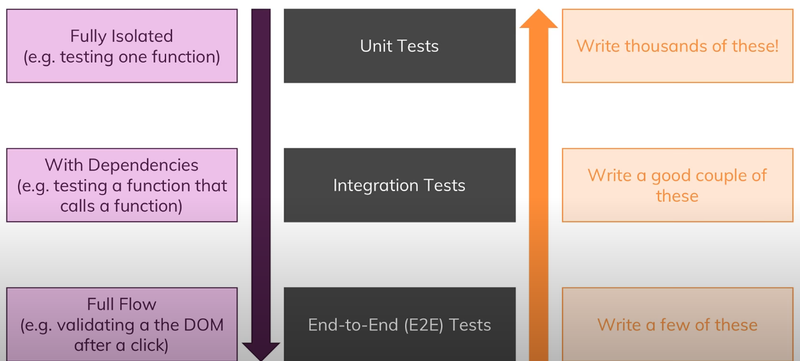

## What is testing in javascript?
- There are two ways of testing web applications:
  - **Manual Testing**
    - 
    - In this type of testing we write our code.
    - Then we run from the browser to see the expected result.
    - We then test by rest api or any other ways and verify it sucessed or failed.
    - If it's failed we modify and fix the actual code and test once again untill we get the expected success.
  - **Automated testing**
    - Testing development code through test code.
    - In automated testing we automate this testing process by writing test code so we don't have to manually test everything in our application.
    - We may still be interested in manual testing.
    - **But automated tests can be run whenever we change something in code to see if that affects any part of our application without us having to test everything manually agian.**

## Why Test?

- **Get an error**
  - We want to test if we get any error and break our code.
  - We want to see without testing manually.
- **Save time**
- **Finding possible bugs**
- **Integrate into build workflow (CICD process)**
  - We could have a build workflow where we push a git commit to our code repository like github and then we have a workflow that automatically is triggered where this code is then tested in the cloud on some server and if the test succeeds it may be deployed automatically.
  - So we can build a complex deployment chain there and tests are then an integral part of ensuring that no breaking or invalid code is deployed.
- **Breakup complex dependencies**
  - We can isolate and modularize overall code base.
- **Improve our code**
  - Helps to write clean code.

## Different Kinds of Tests

- **Tests**
  - **Unit Tests**
  - We test a single isolated unit of our application.
  - It defines as `for input x and y we expect to get output z`.
  - **Integration Tests**
  - We also have some tests that tests unit with some dependencies so we have no isolated piece of code anymore but we might have a function that calls another function.
  - So therefore the function we are testing depends on the result of an another function. And that is called integration test.
  - Here we are testing more than just a single unit, we test integration of a feature to another feature.
  - **End-to-End(E2E) Tests**
  - We can test full flow of a module or user interface. So the full application or a part of the full appplication is tested.
  - This kind of testing is called `End-to-End(E2E)` testing.
  - We could do it manually as well in the browser, but instead we can write kind of automated script that executes a certain series of steps for us and then we can check whether we get the expected result or not.

## Complexity of writing different tests

Here violet line represents complexity.
  - **Unit tests are relativly easy to write.**
  - **Integration tests are more complex than Unit tests**.
    - The more dependencies we add the more complex it becomes it gets harder to differentiate between what exactly is causing an error. 
    - Is it a dependency or the function that uses the dependencies?
    - Also we might have some dependencies that reach out to a server and fetch data. That is also a complexity we have to handle.
  - **E2E tests are the most complex.**
    - Here we have to define every step that should be executed and cleverly think about what we want to test and what we not want to expect there.

## Writing frequency of different tests

Here orange line represents frequency.
- We typically have a lot of unit tests. Because if we test every unit of our application.
- We have some integration tests to rule out that two individually working units don't work anymore.
- We have few e2e tests to test some steps or some flows in our application in the browser in an automated way.

# Backend APP: Todo Application (Expressjs)
We will implement TDD in this app.

## Project setup
- To create an express js application we have to make sure we have `npm` and `nodejs` installed in our machine.
- We created a new folder named `nestjs-express-todo-app` and ran `npx express-generator` to generate an express js application.
- We could also run `npx express-generator --no-view todo-app` to create an app named `todo-app`.
- We run `npm install` to install the dependencies.
- We install `jest` as our dev dependencies which is test runner jest `npm install -D jest`.
- We also install `supertest` we that we are going to use to test apis specifically: `npm install -D supertest`.
- We can run install both the dependencies in a single command: `npm install -D jest supertest`.
- To verify the dependencies are install we can check `package.json` file and look for this
  ```javascript
   "devDependencies": {
    "jest": "^28.1.3",
    "supertest": "^6.2.4"
  }
  ```
- Then we add a new `test` script which runs `jest --watchAll` flag so that anytime our code change it's going to rerun the tests for us which is very important for tdd.
  ```javascript
  "scripts": {
    "test": "jest --watchAll"
  }
  ``` 
- To verify we can run `npm test`. It won't find any tests so we are going to create a file named `app.test.js` file.
- In `app.test.js` file we add a demo test case and `npm test` will pass automatically.
  ```javascript
  it('should run', () => {})
  ``` 

## Writing test cases in `app.test.js`
- We import necessary dependencies.
- The TDD approach is 
  - We first write our tests and we they would fail.
  - We refactor our code until the tests are passing.
  - Then we refactor and improve our code and add more test cases from that.
  - We are going to group the tests using `describe()` function.

## Todo Application folder structure
- In `route` folder's `index.js` file we have an index route and `users.js` file we have user route defined.

## Business logic (Todo Application)
- Create  todo
- Read todo
- Update todo
- Delete todo

## Implementing TDD scenario by scenario
### Scenario-1, We are assuming we might have some apis. We write test cases and they will fail.
-  
  ```javascript
    describe('Todos', () => {
      it('GET /todos --> todos array', () => {})
      it('GET /todos/id --> specific todo by ID', () => {})
      it('GET /todos/id --> 404 if not found', () => {})
      it('POST /todos --> created todo', () => {})
      it('GET /todos --> validates request body', () => {})
  })
    ```
  - We are going to return fake request and we are going to pass in our application in there.
  - 
    ```javascript
    describe('Todos', () => {it('GET /todos --> todos array', () => 
    {
        return request(app).get('/todos')
            .expect('Content-Type', /json/) // asserting content type to be json
            .expect(200) // asserting response to be 200
            .then(response => {
                expect(response.body).toEqual(
                    expect.arrayContaining([  // asserting the response has array containing
                        expect.objectContaining({
                            id: expect.any(Number),
                            name: expect.any(String),
                            completed: expect.any(Boolean)
                        })
                    ])
                )
            })
    })

    it('GET /todos/id --> specific todo by ID', () => {
        return request(app).get('/todos/1')
            .expect('Content-Type', /json/) // asserting content type to be json
            .expect(200) // asserting response to be 200
            .then(response => {
                expect(response.body).toEqual(
                        // asserting the object has name and completed property
                        expect.objectContaining({
                            name: expect.any(String),
                            completed: expect.any(Boolean)
                        })
                    ) // asserting the response has array containing
            })
    })

    it('GET /todos/id --> 404 if not found', () => {
        return request(app).get('/todos/999999').expect(404);
    })

    it('POST /todos --> created todo', () => {  
        return request(app).post('/todos').send({
            name: 'do dishes'
        })
            .expect('Content-Type', /json/)
            .expect(201)
            .then(response => {
                expect(response.body).toEqual(
                        expect.objectContaining({
                            name: 'do dishes',
                            completed: false
                        })
                    )
            })
    });

    it('POST /todos --> validates request body', () => {
        return request(app).post('/todos')
            .send({ name: 123 })
            .expect(422);
    });
    });
    ```
### Scenario-2, We refactor the code
- We add a new route `todo.js` and register it to `app.js` file.
- **Passing `GET /todos --> todos array`**
- We then add code to the route `/todos` and pass one of our test cases.
```javascript
const todos = [
  {
    id: 1,
    name: 'Do something',
    completed: false
  }
]

router.get('/', function (req, res, next) {
  res.json(todos);
});
```
- **Passing `GET /todos/id --> specific todo by ID`**
- We run `npm install http-errors` to install http errors.

- **Passing `GET /todos/id --> 404 if not found`**
- **Passing `POST /todos --> created todo`**
- **Passing `POST /todos --> validates request body`**

#### Scenario-3, We run the app and add more tests
- We run the application as `npm start`.
- We can request from postman to test the apis.
- We add more tests based on our requirements.

## References
- Frontend: https://www.youtube.com/watch?v=r9HdJ8P6GQI
- Backend: youtube.com/watch?v=M44umyYPiuo