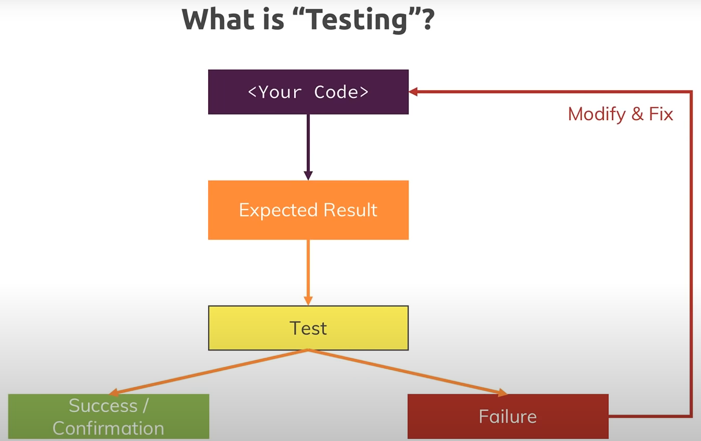
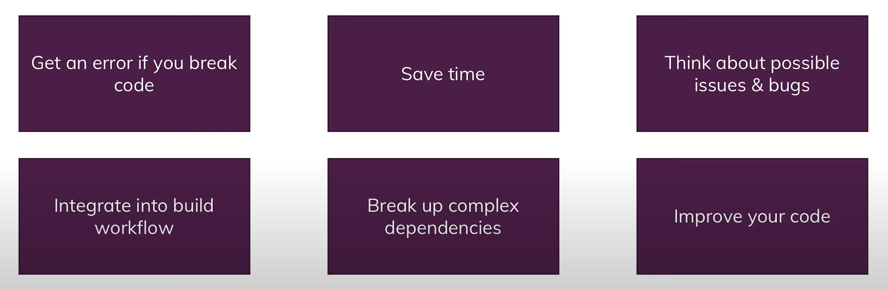
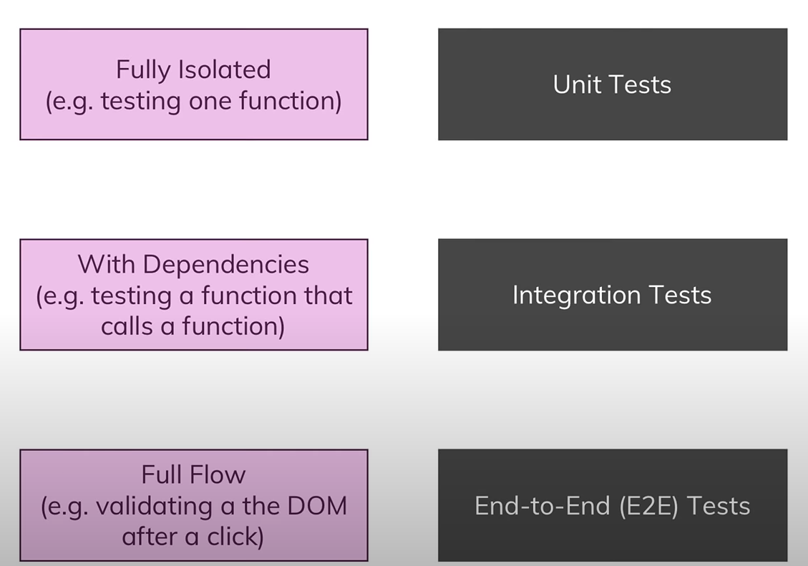
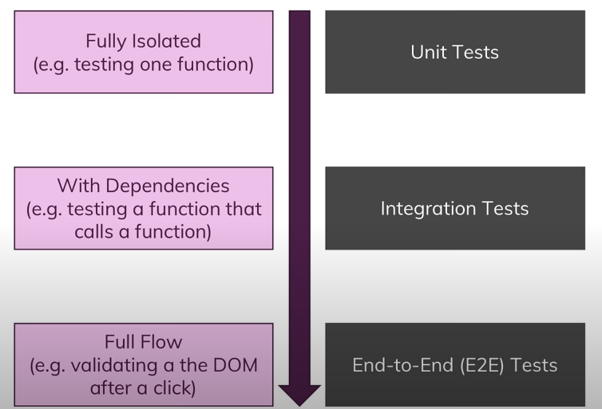

## What is testing in javascript?
- There are two ways of testing web applications:
  - **Manual Testing**
    - 
    - In this type of testing we write our code.
    - Then we run from the browser to see the expected result.
    - We then test by rest api or any other ways and verify it sucessed or failed.
    - If it's failed we modify and fix the actual code and test once again untill we get the expected success.
  - **Automated testing**
    - Testing development code through test code.
    - In automated testing we automate this testing process by writing test code so we don't have to manually test everything in our application.
    - We may still be interested in manual testing.
    - **But automated tests can be run whenever we change something in code to see if that affects any part of our application without us having to test everything manually agian.**

## Why Test?

- **Get an error**
  - We want to test if we get any error and break our code.
  - We want to see without testing manually.
- **Save time**
- **Finding possible bugs**
- **Integrate into build workflow (CICD process)**
  - We could have a build workflow where we push a git commit to our code repository like github and then we have a workflow that automatically is triggered where this code is then tested in the cloud on some server and if the test succeeds it may be deployed automatically.
  - So we can build a complex deployment chain there and tests are then an integral part of ensuring that no breaking or invalid code is deployed.
- **Breakup complex dependencies**
  - We can isolate and modularize overall code base.
- **Improve our code**
  - Helps to write clean code.

## Different Kinds of Tests

- **Tests**
  - **Unit Tests**
  - We test a single isolated unit of our application.
  - It defines as `for input x and y we expect to get output z`.
  - **Integration Tests**
  - We also have some tests that tests unit with some dependencies so we have no isolated piece of code anymore but we might have a function that calls another function.
  - So therefore the function we are testing depends on the result of an another function. And that is called integration test.
  - Here we are testing more than just a single unit, we test integration of a feature to another feature.
  - **End-to-End(E2E) Tests**
  - We can test full flow of a module or user interface. So the full application or a part of the full appplication is tested.
  - This kind of testing is called `End-to-End(E2E)` testing.
  - We could do it manually as well in the browser, but instead we can write kind of automated script that executes a certain series of steps for us and then we can check whether we get the expected result or not.

## Complexity of writing different tests

Here violet line represents complexity
  - **Unit tests are relativly easy to write.**
  - **Integration tests are more complex than Unit tests**.
    - The more dependencies we add the more complex it becomes it gets harder to differentiate between what exactly is causing an error. 
    - Is it a dependency or the function that uses the dependencies?
    - Also we might have some dependencies that reach out to a server and fetch data. That is also a complexity we have to handle.
  - **E2E tests are the most complex.**
    - Here we have to define every step that should be executed and cleverly think about what we want to test and what we not want to expect there.

## Writing frequency of different tests
- We typically have a lot of unit tests. Because if we test every unit of our application.